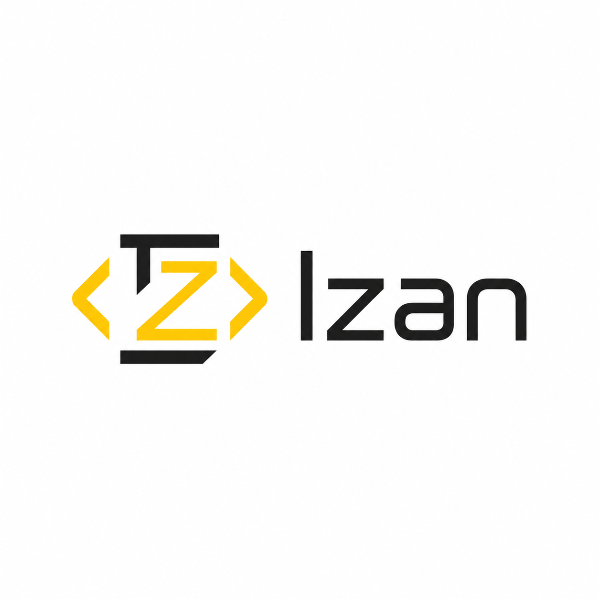

# Portafolio Izan Carlo Celis Afonso

<div align="center">
  

  <h3>Portafolio profesional Full Stack construido con React, TypeScript y Vite</h3>

  <p>
    <a href="mailto:izanwork2@gmail.com">Contacto</a>
    ·
    <a href="https://github.com/IzanKing2">GitHub</a>
    ·
    <a href="#proyectos-destacados">Proyectos</a>
  </p>

  <p>
    
    
    
    
  </p>
</div>

---

## Descripción

Este repositorio contiene el portafolio profesional de **Izan Carlo Celis Afonso**, desarrollado como carta de presentación para oportunidades como **Desarrollador Web Full Stack**.

El objetivo del proyecto es transmitir criterio técnico, sensibilidad por el diseño UI/UX y dominio de herramientas modernas mediante una experiencia web rápida, responsive, animada y mantenible.

## Características

| Área | Detalle |
| --- | --- |
| Enfoque | Portafolio profesional para empleabilidad Full Stack |
| Arquitectura | Aplicación SPA con componentes React y carga diferida de secciones |
| Diseño | Dark mode por defecto, estética limpia, acento amarillo y layout responsive |
| Animaciones | Framer Motion, reveal on scroll, hero con partículas en canvas y cursor personalizado |
| SEO | Metadatos dinámicos con `react-helmet-async` |
| Calidad | Tests con Vitest y Testing Library, build automatizado en GitHub Actions |
| Estilos | CSS Modules y tokens globales en CSS, sin librerías UI externas |

## Stack Técnico

| Categoría | Tecnologías |
| --- | --- |
| Core | React 19, TypeScript, Vite |
| Estilos | CSS Modules, CSS custom properties, diseño responsive |
| Animaciones | Framer Motion, Canvas API |
| Iconografía | React Icons |
| SEO | React Helmet Async |
| Testing | Vitest, Testing Library, jsdom |
| Calidad y CI | GitHub Actions, Oxlint |
| Deploy objetivo | Vercel o GitHub Pages |

## Secciones Del Portfolio

| Sección | Contenido |
| --- | --- |
| Hero | Mensaje principal, nombre, frases dinámicas y llamadas a la acción |
| Sobre mí | Perfil profesional, valores y enfoque como desarrollador |
| Tecnologías | Skills agrupadas por frontend, backend, sistemas y herramientas |
| Proyectos | Cards con descripción, stack, repositorio y estado destacado |
| Experiencia | Timeline profesional con beca Cataliza y prácticas FP Dual |
| Contacto | Email, GitHub, teléfono y formulario básico |

## Proyectos Destacados

| Proyecto | Descripción | Stack |
| --- | --- | --- |
| GeekZone - E-commerce | Marketplace de coleccionables con catálogo, carrito, favoritos, panel admin y API REST documentada con Swagger. | Laravel, PHP, MySQL, Docker, Nginx, JWT, Swagger |
| Hybrid Furniture Store | Arquitectura orientada a servicios con APIs independientes y tienda principal desacoplada. | Laravel, PHP, MySQL, API REST, SOA |
| Notes REST API | API REST con Java y Spring Boot para gestión de usuarios y notas, validaciones, excepciones globales y tests. | Java, Spring Boot, MySQL, JUnit, Mockito, Postman |

## Estructura Del Proyecto

```text
portafolio-izan/
├── assets/                 # Recursos visuales del proyecto
├── public/                 # Favicon, robots e iconos públicos
├── specs/                  # Especificación funcional del portfolio
├── src/
│   ├── assets/             # Imágenes usadas por la aplicación
│   ├── components/         # Componentes principales de la interfaz
│   ├── data/               # Datos de proyectos, experiencia y tecnologías
│   ├── hooks/              # Hooks reutilizables
│   ├── styles/             # CSS Modules por componente
│   ├── App.tsx             # Composición principal de la aplicación
│   └── main.tsx            # Punto de entrada React
├── .github/workflows/      # Pipeline de CI
├── vite.config.ts          # Configuración de Vite y Vitest
└── package.json            # Scripts y dependencias
```

## Instalación Y Uso

Requisitos recomendados:

| Herramienta | Versión |
| --- | --- |
| Node.js | 20.x o superior |
| npm | Incluido con Node.js |

Instalar dependencias:

```bash
npm install
```

Ejecutar en desarrollo:

```bash
npm run dev
```

Crear build de producción:

```bash
npm run build
```

Previsualizar la build:

```bash
npm run preview
```

Ejecutar tests:

```bash
npm run test -- --run
```

## Scripts Disponibles

| Script | Descripción |
| --- | --- |
| `npm run dev` | Inicia el servidor de desarrollo de Vite |
| `npm run build` | Genera la versión optimizada para producción |
| `npm run preview` | Sirve localmente la build generada |
| `npm run test` | Ejecuta la suite de tests con Vitest |
| `npm run lint` | Ejecuta el análisis estático configurado en el proyecto |

## Calidad Y CI

El repositorio incluye un workflow de GitHub Actions que se ejecuta en `push` y `pull_request` sobre `main` y `master`.

Pipeline actual:

```text
npm ci
npm run test -- --run
npm run build
```

Esto valida que el proyecto instala correctamente sus dependencias, supera los tests y genera una build de producción funcional.

## Perfil Profesional

| Campo | Información |
| --- | --- |
| Nombre | Izan Carlo Celis Afonso |
| Rol | Desarrollador Web Full Stack |
| Formación | Técnico Superior en Desarrollo de Aplicaciones Web, CIFP Villa de Agüimes |
| Experiencia | Servibyte S.L., beca Cataliza y prácticas FP Dual |
| Email | [izanwork2@gmail.com](mailto:izanwork2@gmail.com) |
| GitHub | [github.com/IzanKing2](https://github.com/IzanKing2) |

## Principios Del Proyecto

- Diseño propio sin frameworks UI genéricos.
- Código organizado por componentes, datos, hooks y estilos.
- Experiencia responsive y mobile-first.
- Animaciones sutiles orientadas a mejorar la percepción de calidad.
- Contenido fácil de actualizar desde ficheros de datos.
- Preparado para despliegue estático en plataformas modernas.

---

<div align="center">
  <strong>Clean code, thoughtful design, real delivery.</strong>
</div>
